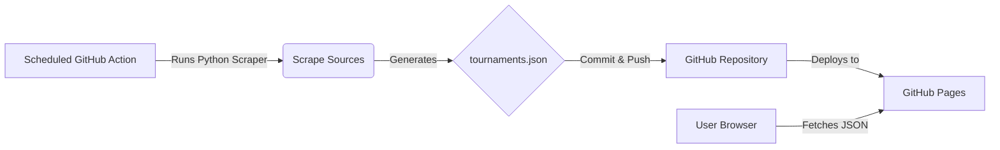

# Serverless Padel Aggregator Architecture

This document outlines how to build a fully automated Padel Tournament aggregator using **Git Scraping**, hosted entirely for free on GitHub Pages.

## The "Git Scraping" Concept

Instead of paying for a database and a backend server, we use **GitHub** as our backend.

1.  **Scraper (Backend)**: A GitHub Action runs your Python script every night (CRON).
2.  **Database**: The script saves the results to a file, e.g., `tournaments.json`, and **commits** it back to the repository.
3.  **Frontend**: A static website (hosted on GitHub Pages) fetches this raw `tournaments.json` file to display the data.

## Architecture Diagram

## Tech Stack Recommendation

### Backend (The Scraper)

- **Language**: Python (using the script we designed).
- **Automation**: `.github/workflows/scrape.yml` (Runs daily).
- **Storage**: JSON file in the repo.

### Frontend (The UI)

- **Host**: GitHub Pages (Free).
- **Framework**: **React + Vite** (Recommended) or Vanilla JS.
  - React allows for easy filtering ("search", "date range") which you requested.
  - A simple `fetch('tournaments.json')` loads the data.

## Pros & Cons

| Pros                                 | Cons                                                          |
| :----------------------------------- | :------------------------------------------------------------ |
| **$0 Cost** (Free hosting & compute) | Data is only as fresh as the last scrape (e.g., once per day) |
| **No Server Maintenance**            | History pollution (lots of commits if data changes often)     |
| **Open Source Friendly**             |                                                               |

## Next Steps

1.  Create a simple `index.html` prototype that reads a dummy `data.json`.
2.  Set up the GitHub Action workflow file.
